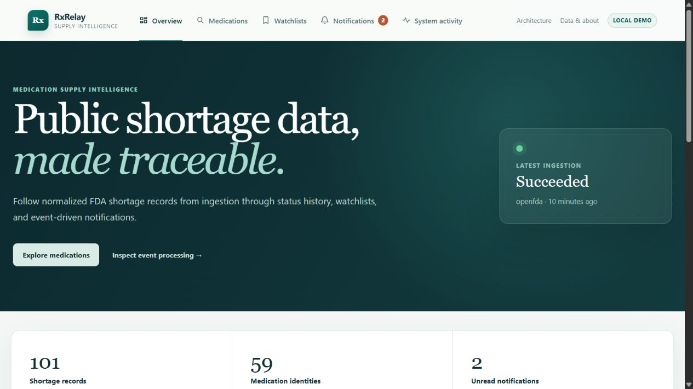
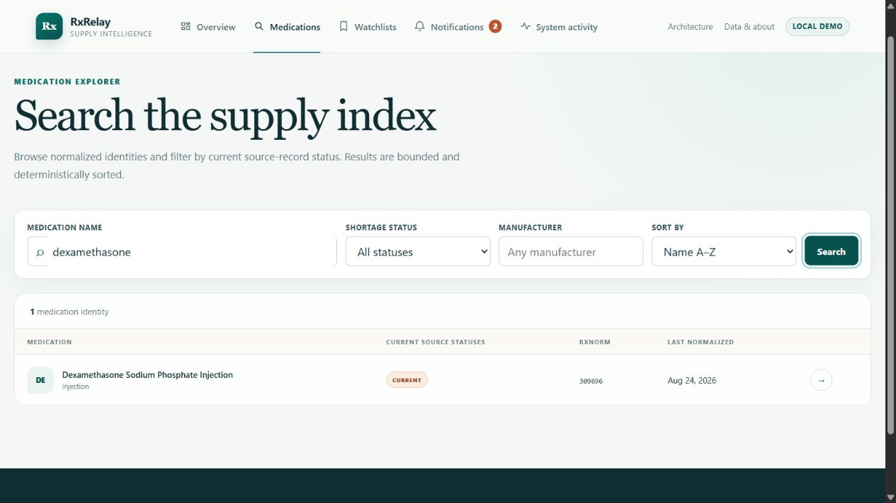
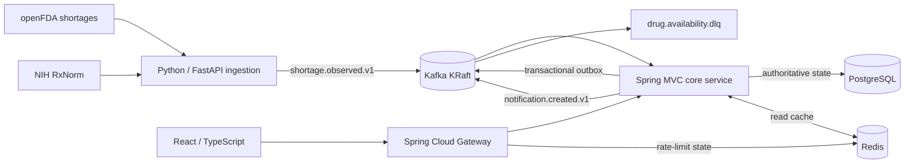
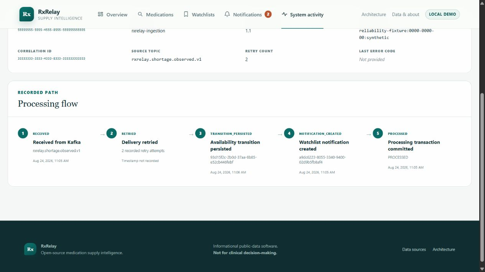

# RxRelay

**Medication Supply Intelligence & Event-Driven Monitoring Platform**

RxRelay ingests public FDA medication-shortage records, normalizes drug identity with NIH RxNorm, preserves availability history, and turns meaningful changes into searchable watchlist notifications.

It is an independently developed open-source reference system—not a clinical decision tool, inventory feed, patient application, or substitute for FDA and pharmacist guidance.



## What is implemented

- real, bounded openFDA ingestion with pagination, validation, per-record isolation, timeouts, and finite exponential retry
- deterministic identity handling that distinguishes source-provided RxCUIs, confident RxNorm matches, ambiguous results, and unresolved names
- normalized PostgreSQL persistence with Flyway migrations, source provenance, immutable observations, and meaningful status transitions
- at-least-once Kafka processing with durable idempotency, bounded retries, a dead-letter topic, and a transactional outbox
- paginated medication search, detail, provenance, timeline, watchlist, notification, overview, ingestion-run, and event-inspection APIs
- Redis-backed gateway rate limiting plus disposable search/detail caching that fails open to PostgreSQL and is invalidated by change events
- responsive React UI with explicit loading, empty, unavailable-data, rate-limit, and backend-failure states
- structured logs, correlation IDs, Actuator health/readiness, Prometheus metrics, reproducible tests, containers, CI, and stateless Kubernetes manifests



## Architecture



The architecture is event-driven because ingestion publishes immutable observations instead of directly mutating application state. The core consumer validates each event, claims its globally unique ID in PostgreSQL, applies a state transition and any watchlist notification in one transaction, then records outbound events in the same transaction. Kafka and outbox publication are at least once; persistent IDs make repeated delivery a no-op. See [event-flow.md](docs/event-flow.md) and [ADR-005](docs/adr/ADR-005-at-least-once-delivery-and-idempotency.md).

PostgreSQL is authoritative. Redis may disappear without losing medication or user-visible state. Kafka’s local single broker is deliberately lightweight and is not presented as a production HA topology.

## Technology

| Layer | Technology |
|---|---|
| Edge and domain API | Java 21, Spring Boot 3, Spring Cloud Gateway, Spring MVC, Bean Validation, JPA/Hibernate, Flyway, springdoc OpenAPI, Micrometer |
| Ingestion | Python 3.12, FastAPI, Pydantic, httpx, aiokafka, jsonschema |
| Interface | React 18, TypeScript, Vite, React Router, TanStack Query |
| State and messaging | PostgreSQL 16, Redis 7, Apache Kafka 3 in KRaft mode |
| Delivery and quality | Docker Compose, Kubernetes/Kustomize, GitHub Actions, JUnit 5, pytest, Vitest, Playwright, k6, Ruff, mypy, ESLint, Spotless, SpotBugs |

## Quick start

Prerequisite: Docker Engine/Desktop with Compose v2 and at least 4 GB assigned to Docker. The declared service limits total about 2.85 GB, keeping the normal stack viable on the project’s 8 GB target workstation.

```bash
cd rxrelay
docker compose up --detach --build --wait --wait-timeout 360
python scripts/smoke/compose-smoke.py
curl --fail-with-body -X POST "http://localhost:8090/api/v1/ingestions?limit=100"
```

A `.env` file is optional; copy [.env.example](.env.example) only to override safe development defaults. No public data is fabricated or silently seeded.

Open:

- Web product: <http://localhost:5173>
- Gateway API: <http://localhost:8080/api/v1/overview>
- Core Swagger UI: <http://localhost:8081/swagger-ui.html>
- Ingestion status: <http://localhost:8090/api/v1/ingestions/status>

Stop without deleting data using `docker compose down`. Use `docker compose down --volumes` only when you intentionally want a clean database and broker. Host-based setup and Windows commands are in [development.md](docs/development.md).

## API example

```bash
curl "http://localhost:8080/api/v1/drugs?query=dexamethasone&page=0&size=20&sort=name,asc"
curl "http://localhost:8080/api/v1/drugs/{drugId}/timeline?page=0&size=20"
curl -X POST "http://localhost:8080/api/v1/watchlists" \
  -H "Content-Type: application/json" \
  -d '{"name":"Critical injectables"}'
```

Responses use bounded pages and a stable error envelope with `code`, `message`, `status`, `path`, `timestamp`, and `correlationId`. The complete contract is [rxrelay-api.v1.yaml](contracts/openapi/rxrelay-api.v1.yaml), with endpoint behavior documented in [api.md](docs/api.md).

## Event processing example

```text
shortage.observed.v1
  received -> validated -> transition persisted -> cache invalidated
           -> watchlists evaluated -> notification created -> processed
```

Only recorded steps appear in the event inspector. During the 2026-08-24 release verification, a clearly labeled synthetic Reliability Lab event was delivered three times and produced one processed-event row, one observation, and one logical transition. A watched follow-up transition, also delivered three times, produced one notification. These events were not FDA claims; they existed only to prove deterministic handling of a change that a repeated unchanged live snapshot cannot supply on demand.



## Real data and provenance

The canonical workflow reads [openFDA Drug Shortages](https://open.fda.gov/apis/drug/drugshortages/) and uses the [NIH RxNorm API](https://lhncbc.nlm.nih.gov/RxNav/APIs/RxNormAPIs.html) only when source data permits a deterministic match. Original source names and identifiers are retained alongside the normalized identity, source update time, ingestion run, relevant raw values, and state fingerprint.

The verified 100-record run on 2026-08-24 fetched and published 100 source records with zero malformed-record rejections. Its exact timestamps, normalization summary, persisted counts, and the unchanged second-run comparison are recorded in [data-sources.md](docs/data-sources.md). Disappearance from a bounded response is never called “resolved,” and inventory quantities, facility availability, demand, substitutions, and clinical guidance are left unavailable because the source does not reliably provide them.

## Reliability and failure behavior

- duplicate event IDs cannot create duplicate transitions or notifications
- out-of-order source updates remain observations but cannot overwrite newer current state
- malformed/non-retryable events are wrapped with safe metadata and sent to `drug.availability.dlq`
- handler failures retry twice with bounded exponential delay, then dead-letter
- Redis failures are metered and logged while authoritative reads continue from PostgreSQL
- state plus outbound events commit through a transactional outbox; publication is retried safely
- HTTP and Kafka clients use finite connection/request/send timeouts and bounded retry

The developer-only Reliability Lab is disabled unless the `reliability-lab` Spring profile is explicitly enabled. Actual recovery observations and commands are in [reliability.md](docs/reliability.md).

## Testing and measured performance

```bash
./scripts/verify.sh                 # Java, Python, frontend, contracts, static analysis
./scripts/test-integration.sh       # health-gated Compose smoke, then cleanup
make web-e2e                       # critical browser flow
make performance                   # bounded API benchmark helper
```

PowerShell equivalents are provided for repository-wide and integration checks. CI repeats layer-specific tests, event/OpenAPI drift checks, Docker image builds, manifest rendering, a Compose smoke path, and Trivy dependency/secret/misconfiguration scanning. See [testing.md](docs/testing.md).

The canonical local k6 run used the complete Compose stack, 59 medication concepts and 101 shortage records, four virtual users for 15 seconds, and 793 requests: **p50 49.01 ms, p95 188.24 ms, p99 269.71 ms, 51.78 requests/s, 0% observed HTTP errors**. A 60-pair Redis comparison observed a lower warm mean (12.669 ms) than cold mean (22.557 ms), but warm was faster in only 41/60 pairs; the small dataset and noisy desktop environment make this engineering evidence, not a production capacity claim. Exact command, environment, raw k6 summary, database plans, and limitations are in [performance.md](docs/performance.md).

## Repository map

```text
apps/web/                       React product interface
services/gateway/               edge routing, correlation, rate limiting
services/core-service/          domain APIs, persistence, Kafka consumer/outbox
services/ingestion-service/     openFDA/RxNorm adapters and producer
contracts/openapi/              versioned REST contract and generated client source
contracts/events/               versioned JSON Schema event contracts
infrastructure/kubernetes/      stateless deployment baseline
docs/                           architecture, operations, evidence, ADRs
scripts/                        smoke, reliability, performance, backup/restore
.github/workflows/              CI, integration, and conditional release builds
```

## Documentation

- [Architecture](docs/architecture.md) · [data model](docs/data-model.md) · [data sources](docs/data-sources.md) · [API](docs/api.md)
- [Event flow](docs/event-flow.md) · [reliability](docs/reliability.md) · [observability](docs/observability.md) · [security](docs/security.md)
- [Development](docs/development.md) · [testing](docs/testing.md) · [performance](docs/performance.md)
- [Deployment](docs/deployment.md) · [operations](docs/operations.md) · [disaster recovery](docs/disaster-recovery.md)
- [Frontend](docs/frontend.md) · [release notes](docs/releases/v1.0.0.md) · [ADRs](docs/adr/)
- [Contributing](CONTRIBUTING.md) · [changelog](CHANGELOG.md) · [v1.0.0 notes](docs/releases/v1.0.0.md)

## Limitations

- The demo identity is not authentication and is never described as a patient or pharmacy account. Add real identity and authorization before multi-user or Internet exposure.
- RxNorm matching is best effort; ambiguous and unresolved names remain visible with provenance.
- A local instance sees changes only between its own observations and cannot reconstruct earlier source history.
- openFDA does not expose a durable primary key, so RxRelay derives one from stable source fields; upstream identity corrections can appear as a new record.
- Ingestion is manual or externally scheduled. The system does not promise real-time FDA freshness.
- The Compose broker and databases are single-node development dependencies. Kubernetes manifests assume externally managed stateful services.
- This project has no reason to ingest or store patient-level data or protected health information (PHI), and it does not do so.

## Security, privacy, and license

Configuration comes from environment variables; checked-in values are development defaults, not production credentials. Reliability endpoints are profile-gated, responses omit stack traces, CORS is restricted, inputs and page sizes are bounded, and logs avoid event payloads and personal data. Review [security.md](docs/security.md) before any exposed deployment.

RxRelay is licensed under [Apache-2.0](LICENSE). Citation metadata is in [CITATION.cff](CITATION.cff). Add the real repository URL and release metadata after publication; no DOI, hosted release, image publication, deployment, external usage, or clinical validation is claimed here.
