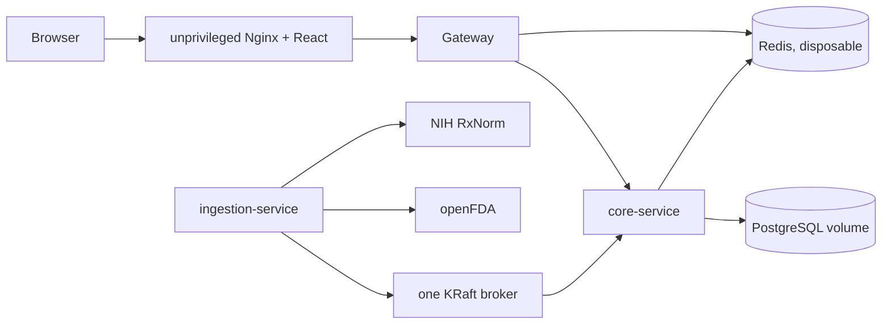
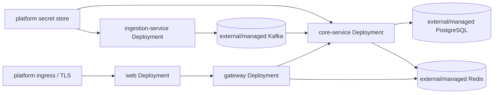

# Architecture

## Context

RxRelay isolates variable, rate-limited public sources from the transactional search and monitoring API.

```text
 openFDA shortage API       NIH RxNorm API
          |                       |
          +-----------+-----------+
                      v
          ingestion-service (FastAPI)
          typed adapters | normalization
          retries/cache  | run lifecycle
                      |
                      | rxrelay.shortage.observed.v1
                      v
              Kafka (at least once)
                      |
                      v
 React web -> gateway -> core-service -> PostgreSQL
                 |          |    |
                 |          |    +-> transactional outbox
                 +----------+-> Redis
                               |            |
                               |            +-> rxrelay.notification.created.v1
                               +-> rxrelay.availability.changed.v1
```

## Responsibilities

### Gateway

The gateway owns routing, CORS, correlation IDs, health reporting, and Redis-backed token-bucket limits. It contains no medication domain logic.

### Ingestion service

The Python service owns the openFDA and RxNorm adapters. It validates page and record shapes with Pydantic, normalizes whitespace/enums/dates, paginates in pages of at most 100, applies finite timeouts and bounded exponential retry to transient failures, and caches bounded RxNorm results in-process. Runs are bounded and serialized per process. A malformed record is counted and skipped without discarding valid peers.

`IngestionRunStarted`, `ShortageObserved`, and `IngestionRunCompleted` use the versioned ingestion envelope. All run events use the source key so lifecycle order is preserved for this small feed. Producer idempotence protects retries within a producer session; consumers still assume at-least-once delivery.

### Core service

The Spring service owns medication concepts, products, source state, observations, history, named demo-user watchlists, notifications, and audit data. Thin MVC controllers map validated DTOs to transactional services. It writes the processed-event marker, domain update, status change, notifications, audit entries, and outbox record in one transaction. An unchanged observation is retained but creates no history, notification, or domain event.

The outbox publisher emits versioned `DrugAvailabilityChanged` and `NotificationCreated` events after commit. Failed publication is retried with bounded exponential scheduling and becomes an inspectable terminal failure after the configured maximum, avoiding a database/Kafka dual-write gap without an infinite loop.

The raw Kafka consumer parses strings so malformed JSON reaches the application recovery path. Contract errors skip retry; transient handler failures receive two bounded retries by default, then a validated envelope is sent to `rxrelay.availability.dlq.v1`. The persistent marker exposes safe processing/retry/dead-letter metadata through a bounded system API. See [event-flow.md](event-flow.md) and [reliability.md](reliability.md).

Medication search and detail use short-lived Redis snapshots. Cache interception is fail-soft: connection, serialization, eviction, or clear failures fall through to PostgreSQL. Applied observations clear both caches. The configured single demo identity is a replaceable `DemoUserProvider`, not an authentication claim.

### Web

The React application uses React Router for product routes and TanStack Query for bounded server-state retrieval, mutation invalidation, and stale-query handling. It uses backend responses only. It explicitly labels FDA-provided status and absent source fields, RxRelay-normalized status, and RxNorm identity outcomes. The overview API batches nested medication status lookup so recent changes, watchlists, and notifications retain the same status semantics as medication search without per-row queries.

The event inspector renders a sequence only from durable processing records. It never infers a cache-invalidation or notification step that the backend did not persist. The architecture view is deliberately static documentation rather than a simulated live topology.

## Change semantics

The source payload hash covers the complete canonicalized FDA record and supports provenance/debugging. A distinct state fingerprint covers fields that alter the useful supply representation: source status, availability, presentation, shortage reason, resolved/related information, discontinued date, and dosage form. FDA `Reverified` labels and update dates alone do not create a supply-change event.

- New stable source ID: create latest state, observation, status change, and domain event.
- Existing ID with a different state fingerprint: update state and create the transition/event.
- Existing ID with the same fingerprint: persist only a new run observation.
- Explicit FDA `Resolved`: normalize to `RESOLVED` and process as a change.
- Missing from a later bounded or complete response: no resolution is inferred. FDA does not document absence as a resolution signal.

Domain event IDs are deterministic over source, run, source record, and before/after fingerprints. Incoming observation event IDs are deterministic within a run and source payload. Database uniqueness provides the final duplicate-delivery defense.

## Failure and observability

- External requests have finite timeouts; only timeouts, connection failures, HTTP 429, and 5xx responses retry, using bounded exponential delay.
- RxNorm failure does not drop a valid FDA record. The outcome is stored as `ERROR`, `AMBIGUOUS`, or `UNRESOLVED`; uncertain candidates are never selected.
- Run status exposes `RUNNING`, `SUCCEEDED`, `PARTIAL`, or `FAILED` plus bounded error summaries.
- Spring services expose Actuator liveness/readiness/Prometheus endpoints. FastAPI exposes health, run status, and Prometheus metrics. Logs use standard output and the gateway propagates or creates `X-Request-Id`.
- Core logs use structured JSON and carry event/correlation IDs through consumer work. Kafka readiness and consumer/outbox/event metrics are published without making Redis an authoritative readiness dependency.

The optional Prometheus Compose profile retains one day/256 MB and does not alter application correctness. Metric route labels are templates rather than raw URLs to keep cardinality bounded. See [observability.md](observability.md).

The local topology uses one KRaft broker, PostgreSQL, Redis, two small JVMs, Python, and static Nginx. It stays suitable for an 8 GB development machine; no search cluster, bulk NDC dataset, or ML runtime is present.

## Deployment topologies

Local development is deliberately self-contained and single-node:



The checked-in Kubernetes base represents only the four stateless application workloads. Its service names for PostgreSQL, Redis, and Kafka are connection assumptions to override for the target platform; the repository intentionally does not imply that a single YAML replica is a production database or broker cluster.



An Internet-facing deployment still needs real identity/authorization, ingress policy, TLS, network policy, external secret management, platform autoscaling decisions, and tested managed-service recovery. Those are target-environment responsibilities, not simulated by the demo base.

## Security boundary

No secret is checked in. The API has no production authentication. A configured, server-side demo
identity scopes watchlists and notifications; callers cannot choose an owner with a request header.
This seam must be replaced by real authentication and authorization before a multi-user deployment.
The demo identity is not a patient or pharmacy account. Source data is informational and not clinical
advice.

The gateway restricts CORS, caps request/header size, applies security headers, validates reflected correlation IDs, and rate-limits through Redis. Production profiles hide interactive API documentation and exclude the Reliability Lab; Kubernetes also disables manual ingestion. See [security.md](security.md) for the threat boundary and remaining pre-Internet requirements.
