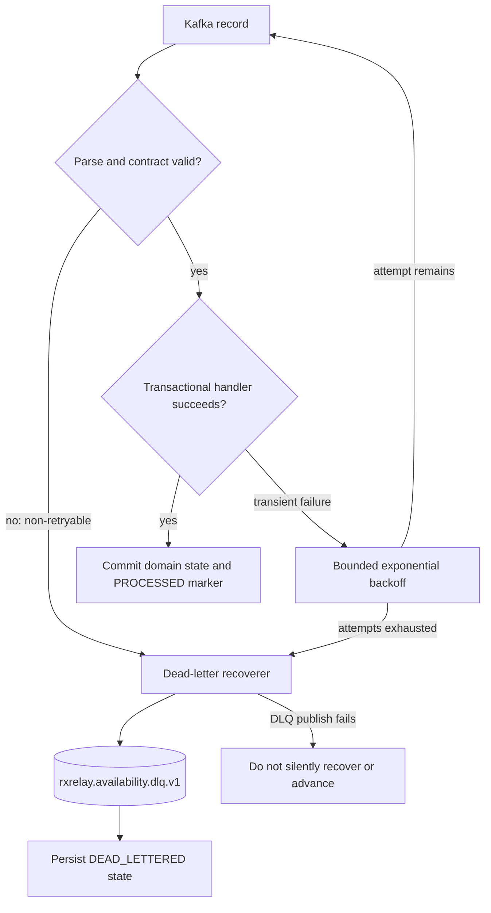
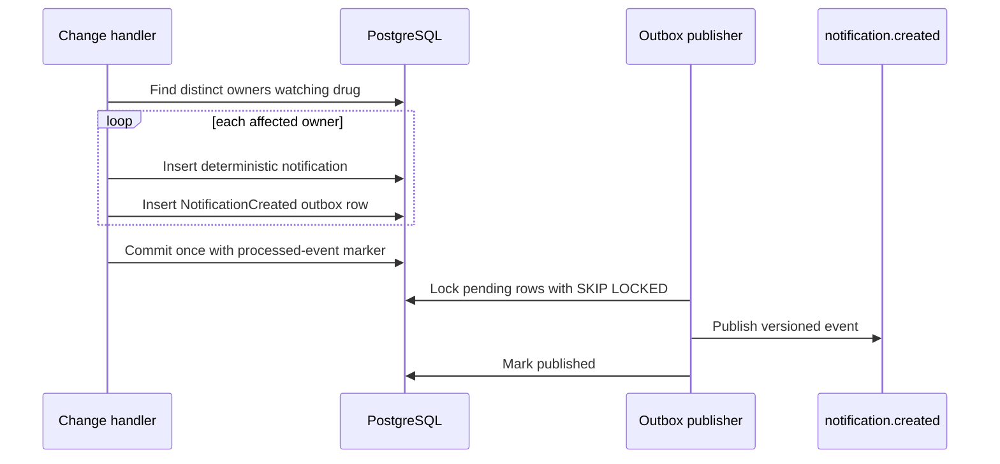

# Event flow

RxRelay uses two event stages. The ingestion service publishes normalized source observations; the core service decides whether an observation is a meaningful availability transition. This keeps source retrieval independent from authoritative PostgreSQL state.

## Ingestion and change detection

```mermaid
flowchart LR
  FDA[openFDA shortages] --> ING[FastAPI ingestion]
  RX[NIH RxNorm] --> ING
  ING -->|IngestionRunStarted<br/>ShortageObserved<br/>IngestionRunCompleted| INPUT[(rxrelay.shortage.observed.v1)]
  INPUT --> PARSE[Parse and validate v1.1 envelope]
  PARSE --> CLAIM[Atomically claim event ID]
  CLAIM --> TX{PostgreSQL transaction}
  TX --> OBS[Persist run and observation]
  TX --> CHANGE[Compare meaningful-state fingerprint]
  CHANGE -->|changed| HISTORY[Persist latest state and transition]
  CHANGE -->|unchanged| EVIDENCE[Retain observation only]
  HISTORY --> CACHE[Invalidate disposable Redis caches]
  HISTORY --> WATCH[Resolve affected watchlist owners]
  WATCH --> NOTIFY[Create one notification per owner]
  HISTORY --> OUTBOX[(Transactional outbox)]
  NOTIFY --> OUTBOX
  OUTBOX -->|after commit| AVAIL[(rxrelay.availability.changed.v1)]
  OUTBOX -->|after commit| NOTICE[(rxrelay.notification.created.v1)]
```

An input event carries a UUID event ID, schema version, event type, UTC occurrence time, UUID correlation ID, producer, source, and ingestion-run ID. `ShortageObserved` also carries the stable derived source record ID and validated normalized payload. The JSON Schema files in `contracts/events/` are the portable contracts; Pydantic and Java validation enforce the same constraints at their boundaries.

The local topics have one partition and replication factor one for the single-broker KRaft environment. The consumer nevertheless creates a referenced run transactionally when an observation arrives before its run-start event, so an externally managed multi-partition topic cannot violate the foreign key through cross-key ordering.

## Retry and dead letter flow

The default consumer policy performs at most two retries after the initial delivery. JSON/contract failures do not retry. A dead-letter envelope records the original topic location, safe exception class, delivery attempts, whether the failure was retryable, and a value capped at 32 KiB. API inspection never exposes the original event body or a stack trace.

## Notification flow

Notification identity derives from availability event ID plus owner ID. Watching the same drug in multiple watchlists therefore produces one logical notification for that owner. Unrelated owners receive nothing.
